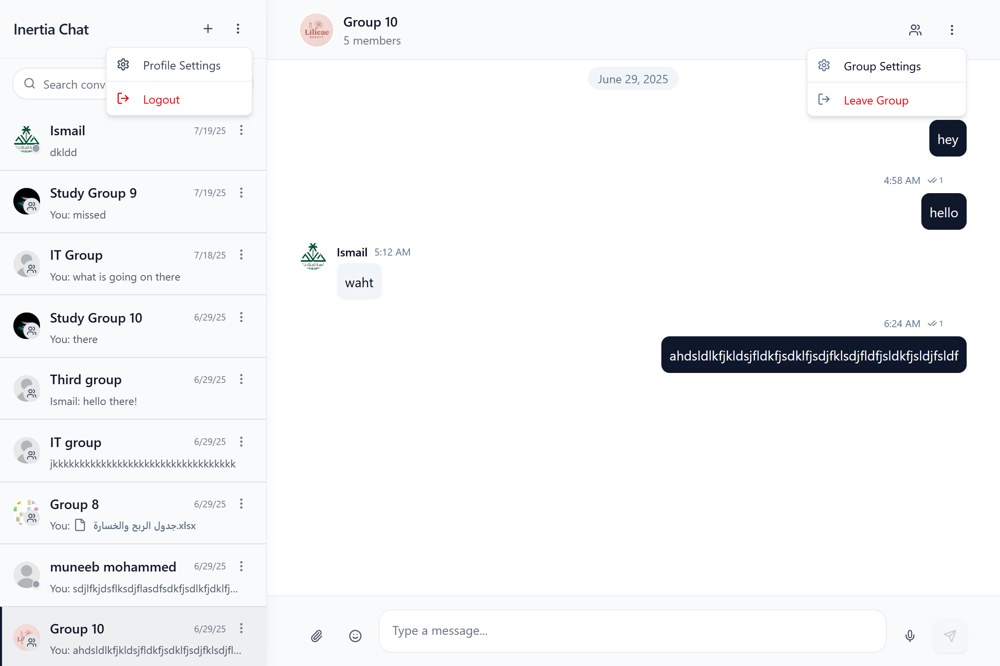

# Inertia Chat – Web Client

A real-time chat web client built with Next.js, supporting direct and group conversations, per-group role-based access, and rich file sharing.

---

## Screenshots

### Login


### Chat List


### Chat View


### New Chat


### Create Group


### Group Settings


### Profile Page


### Group Chat with Dropdowns


---

## Getting Started

### Prerequisites
- Node.js 20+
- npm or pnpm

### Setup

1. Clone the repository
```bash
git clone https://github.com/Muneeb-Almoliky/inertia-chat-web-client.git
cd inertia-chat-web-client
```

2. Install dependencies
```bash
npm install
```

3. Start the development server
```bash
npm run dev
```

4. Open: http://localhost:3000