# Inertia Chat – Web Client

Modern web client for Inertia Chat, built with Next.js.


## Prerequisites

- Node.js 20+
- npm or pnpm
- Backend server running (see [Server](#server) section)

## Getting Started

### 1. Clone the repository

```bash
git clone https://github.com/Muneeb-Almoliky/inertia-chat-web-client.git
cd inertia-chat-web-client
```

### 2. Install dependencies

```bash
npm install
```

### 3. Configure environment variables

Create a `.env.local` file in the project root:

```env
NEXT_PUBLIC_API_URL=http://localhost:8081
NEXT_PUBLIC_WS_URL=http://localhost:8081/ws
```

Adjust the ports if your backend server runs on different ones.

### 4. Start the development server

```bash
npm run dev
```

### 5. Open the application

Navigate to [http://localhost:3000](http://localhost:3000)

## Server

The backend API is built with **Java Spring Boot**.

Repository: [Inertia Chat Server](https://github.com/khaledsAlshibani/inertia-chat-server)

Make sure the backend server is running before starting the web client.

## Screenshots

### Login


### Sign Up
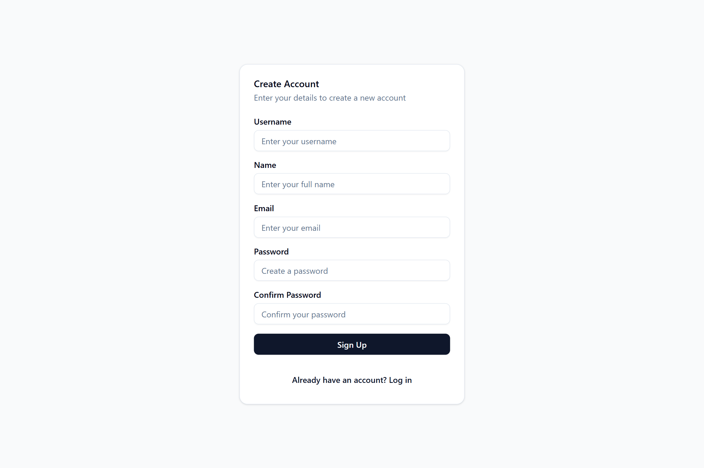

### Chat List
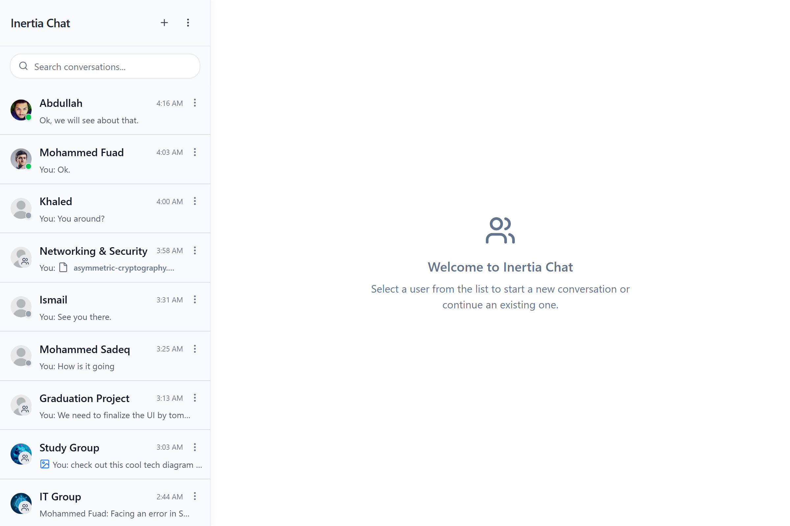

### New Chat
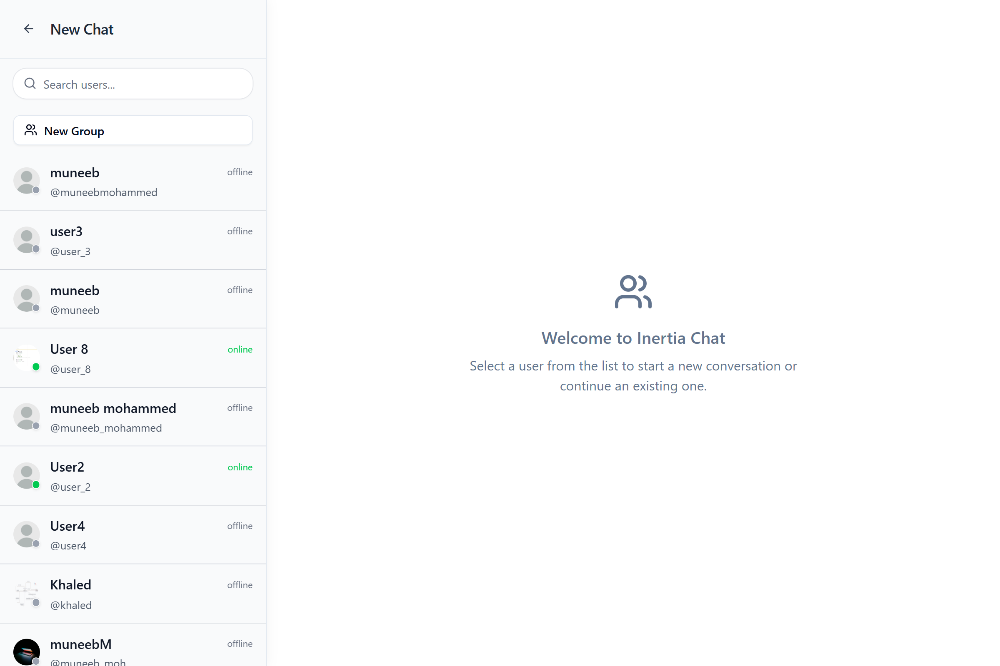

### Direct Chat View
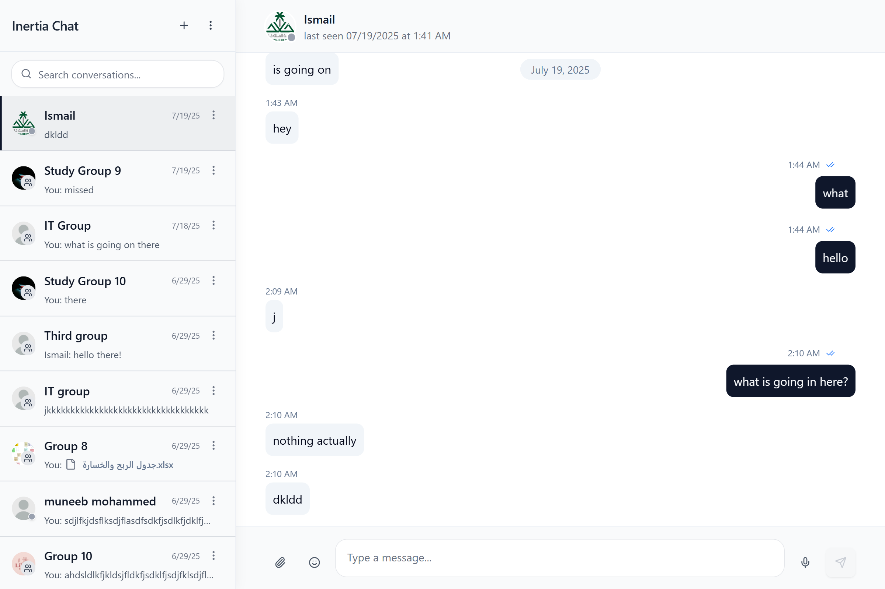

### Group Chat View
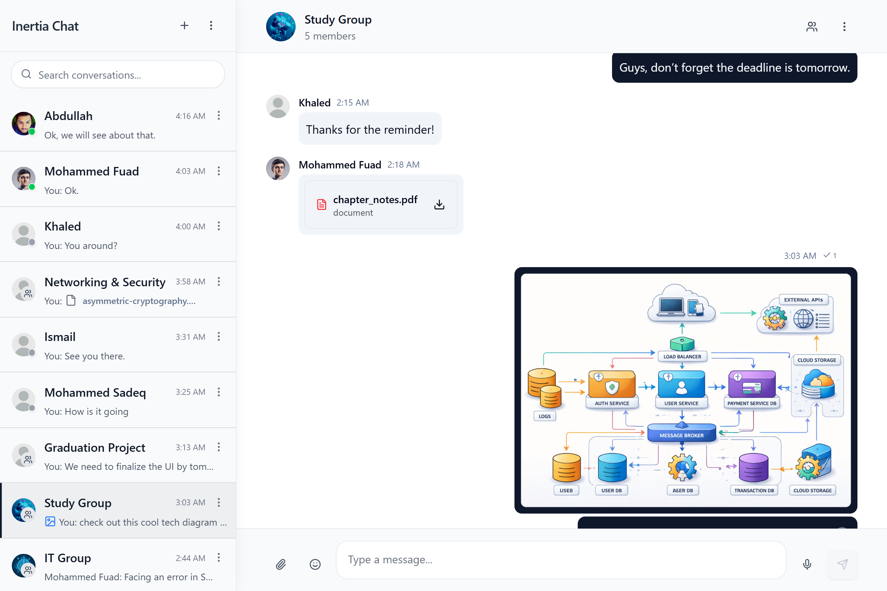

### Create Group
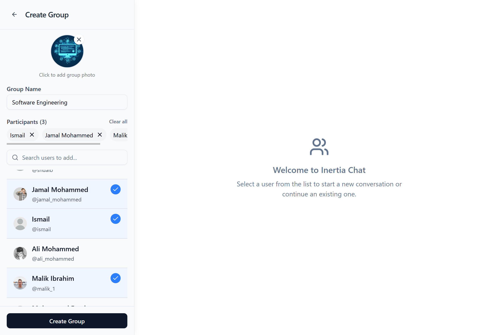

### Group Settings
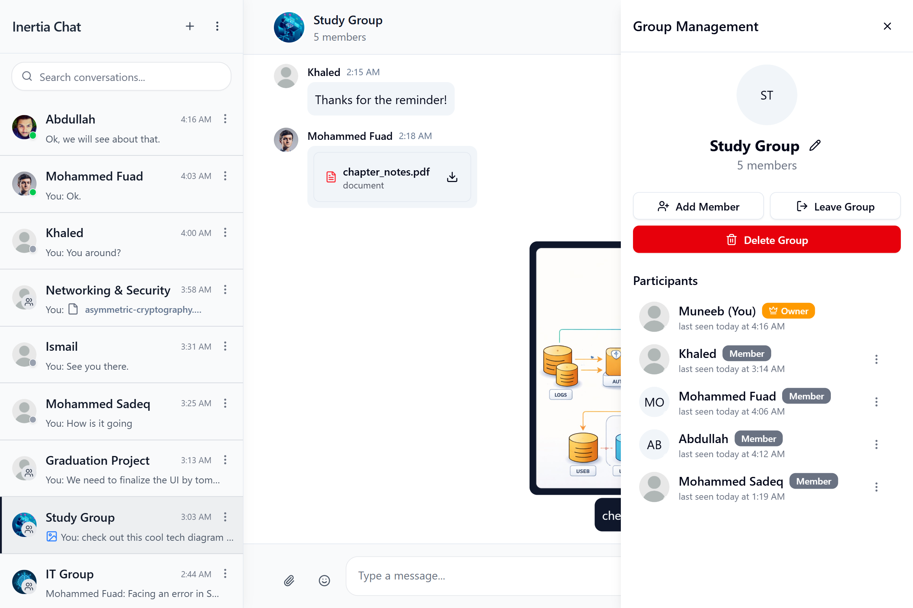

### Add Members Modal
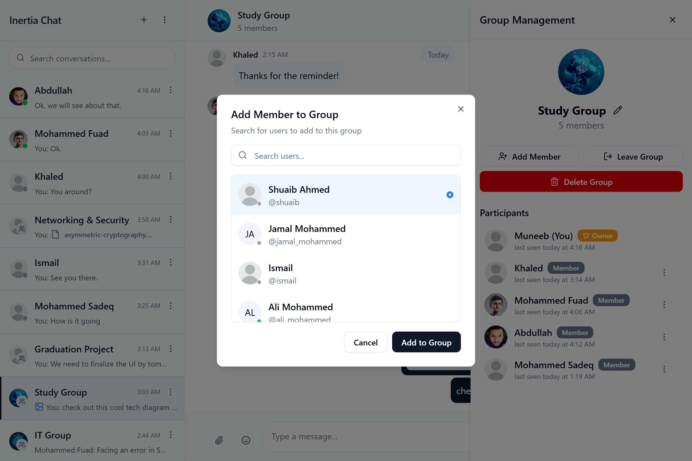

### User Profile
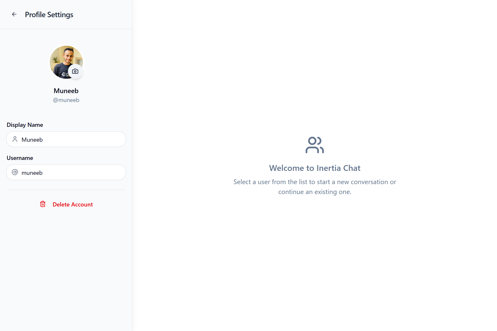

### Menus & Dropdowns
- **User Settings Dropdown**
  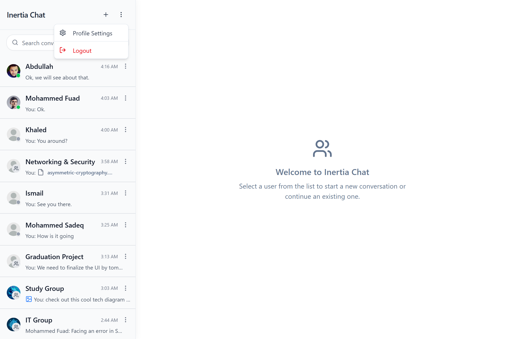
- **Group Settings Dropdown**
  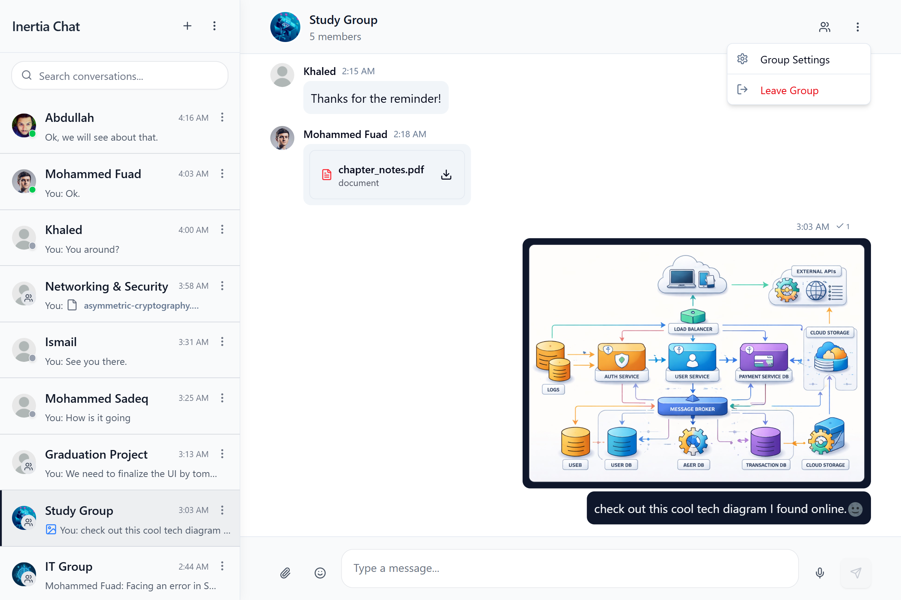
